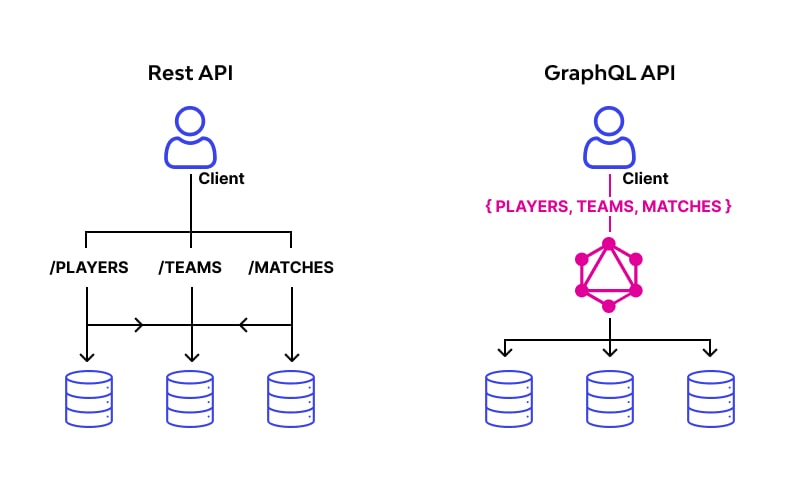

# GRAPHQL LEARN

## APA ITU GRAPHQL
- GraphQL adalah sebuah bahasa kueri untuk API dan runtime untuk memenuhi kueri tersebut dengan data yang ada, dengan deskripsi data yang lengkap dan mudah dimengerti, yang memungkinkan klien meminta data sesuai yang mereka butuhkan dan tidak berlebihan. GraphQL hampir mirip dengan REST namun dengan konsep baru yang membuat kita lebih leluasa untuk mendapatkan data yang kita inginkan. Tidak seperti API yang terkadang dmemberikan data yang kita tidak butuhkan dan dapat memperlambat proses pengambilan data.

## KELEBIHAN GRAPHQL
GraphQL adalah bahasa query untuk API yang dikembangkan oleh Facebook pada tahun 2015. Berikut kelebihan dan kekurangan GraphQL dibandingkan alternatif lainnya :
1. Data Sesuai kebutuhan (no over fetching / under fetching)
  - Klien dapat meminta persis data yang dibutuhkan, tidak lebih dan tidak kurang
  - Mengurangi transfer dat uang tidak perlu antara serve dan lklien
2. Single Endpoint
  - Menggunakan satu endpoint untuk semua permintaan, tidak seperti REST yang memerlukan beberapa endpoint
  - Menyederhanakan struktur API dan memudahkan pengelolaan
3. Strongly typed schema
  - Memiliki skema yang mendefinisikan dengan jelas tipe data yang tersedia
  - Memungkinkan validasi query pada waktu kompilasi
  - Memudahkan dokumentasi dan autodocumentasi
4. Introspection
  - Kemampuan API untuk memberikan informasi tentang skema yang dimilikinya
  - Mendukung alat seperti GraphiQL untuk eksplorasi API secara interaktif
5. Batching dan Caching yang efisien
  - Dapat menggabungkan beberapa permintaan data dalam satu query
  - Memudahkan implementasi caching yang efisien karena struktur data yang konsisten
6. Evolusi API tanpa Versioning
  - Memungkinkan penambahan field baru tanpa memengaruhi klien yang sudah ada
  - Mengurangi kebutuhan untuk versioning API

## KEKURANGAN GRAPHQL
1. Kompleksitas Pembelajaran
   - Kurva pembelajaran yang lebih curam dibandingkan REST
   - Memerlukan pemahaman konsep baru seperti resolver, skema, mutations
2. Optimasi Performa
   - Potensi masalah N+1 query jika tidak diimplementasi dengan baik
   - Memerlukan strategi khusus seperti DataLoader untuk optimasi query database
3. Caching lebih Kompleks
   - Tidak dapat memanfaatkan HTTP Caching standar seperti pada REST
   - Membutuhkan implementasi caching khusus
4. Keamanan Query Kompleks
   - Risiko query yang terlalu kompleks dapat membebani server
   - Memerlukan pembatasan depth, complexity, dan rate limiting
5. Monitoring dan logging
   - Lebih sulit untuk melacak dan mencatat permintaan spesifik
   - Tools monitoring tradisional mungkin kurang efektif
6. Overhead pada permintaan sederhana
   - Untuk kasus sederhana, GraphQL bisa jadi "overkill"
   - Ada biaya pemrosesan tambahan untuk parsing dan validasi query

